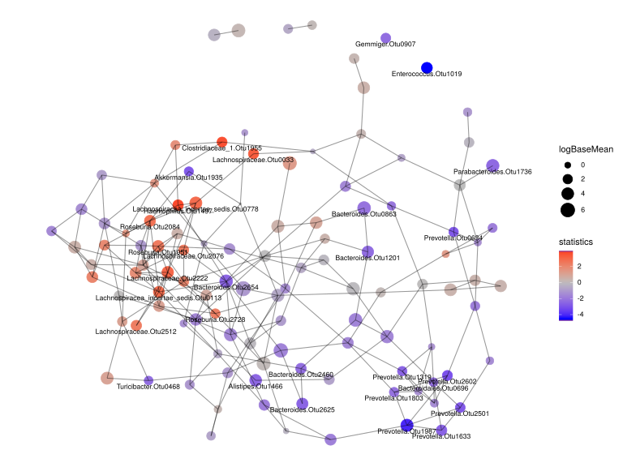

noone@mail.com
Analysis of Dieting study 16S data
% Fri Sep  7 05:46:18 2018

##### \(1.6.1.4.7\) Network Analysis Feature correlation with overlaid differential abundance results 

Build network of interactions between features or samples and plot it. 
                           Network method is network.spiec.easi. Method parameters are: [ list()].

Filtering abundance matrix with arguments [ drop.names:"other"]. Network Analysis

After filtering, left 67 records for 112 features

Kurtz Z, Mueller C, Miraldi E, Bonneau R (????). _SpiecEasi: Sparse Inverse Covariance for Ecological Statistical Inference_. R package version
1.0.2.

\(1.6.1.4.7.1\) [`Figure 1058.`](#figure.1058) Network analysis with method network.spiec.easi. Vertices are labeled by DESeq2 results for                                               baseMean log2FoldChange     lfcSE         stat       pvalue         padj  i.baseMean      baseVar allZero. Showing names for the maximum of 30 top-ranked features.  Image file: [`plots/32374f17c3b.svg`](plots/32374f17c3b.svg).

\(1.6.1.4.7.1\) [`Widget 465.`](#widget.465) Network analysis with method network.spiec.easi. Vertices are labeled by DESeq2 results for                                               baseMean log2FoldChange     lfcSE         stat       pvalue         padj  i.baseMean      baseVar allZero. Showing names for the maximum of 30 top-ranked features. Click to see HTML widget file in full window: [`./1.6.1.4.7.1-323acb3db2Network.analysis.wit.html`](./1.6.1.4.7.1-323acb3db2Network.analysis.wit.html)

<iframe src="./1.6.1.4.7.1-323acb3db2Network.analysis.wit.html" width="800" height="800"> </iframe>