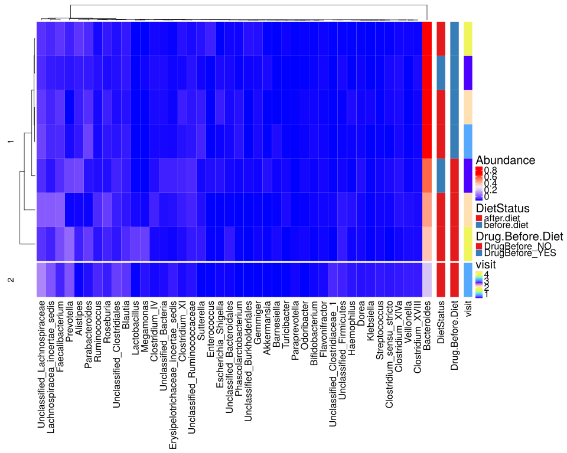

noone@mail.com
Analysis of Dieting study 16S data
% Fri Sep  7 05:46:18 2018

#### \(1.7.1.1\) Taxonomic level: 6 of Subset: Patient samples aggregated as geometric medians post-normalization, split by drug before diet status

##### \(1.7.1.1.1\) Loading counts and metadata

[`Subreport`](./1.7.1.1.1-report.html)

##### \(1.7.1.1.2\) Data analysis

Filtering abundance matrix with arguments [ min_mean                :10, min_quant_incidence_frac:0.25, min_quant_mean_frac     :0.25]. Filtering features

Note that some community richness estimators will not work correctly 
               if provided with abundance-filtered counts

After filtering, left 67 records for 43 features

Wrote counts and metadata for raw counts After final feature filtering to files [`data/1.7.1.1.2.1-32344771d9asamples.raw.16s.l.6.count.tsv`](data/1.7.1.1.2.1-32344771d9asamples.raw.16s.l.6.count.tsv),[`data/1.7.1.1.2.1-32344771d9asamples.raw.16s.l.6.attr.tsv`](data/1.7.1.1.2.1-32344771d9asamples.raw.16s.l.6.attr.tsv)

Wrote counts and metadata for proportions counts After final feature filtering to files [`data/1.7.1.1.2.1-32312b5f084samples.proportions.16s.l.6.count.tsv`](data/1.7.1.1.2.1-32312b5f084samples.proportions.16s.l.6.count.tsv),[`data/1.7.1.1.2.1-32312b5f084samples.proportions.16s.l.6.attr.tsv`](data/1.7.1.1.2.1-32312b5f084samples.proportions.16s.l.6.attr.tsv)

##### \(1.7.1.1.2.2\) Default transformations for further data analysis

Specific methods can override these and use their own normalization.

Count normalization method for data analysis (unless modified by specific methods) : [ drop.features:List of 1,  ..$ :"other", method.args  : list(), method       :"norm.prop"]

Wrote counts and metadata for raw counts Raw after default transformations to files [`data/1.7.1.1.2.2-323572d8a9esamples.raw.16s.l.6.count.tsv`](data/1.7.1.1.2.2-323572d8a9esamples.raw.16s.l.6.count.tsv),[`data/1.7.1.1.2.2-323572d8a9esamples.raw.16s.l.6.attr.tsv`](data/1.7.1.1.2.2-323572d8a9esamples.raw.16s.l.6.attr.tsv)

Wrote counts and metadata for proportions counts Raw after default transformations to files [`data/1.7.1.1.2.2-32356a58b84samples.proportions.16s.l.6.count.tsv`](data/1.7.1.1.2.2-32356a58b84samples.proportions.16s.l.6.count.tsv),[`data/1.7.1.1.2.2-32356a58b84samples.proportions.16s.l.6.attr.tsv`](data/1.7.1.1.2.2-32356a58b84samples.proportions.16s.l.6.attr.tsv)

Wrote counts and metadata for raw counts Normalized after default transformations to files [`data/1.7.1.1.2.2-32341e36b94samples.raw.16s.l.6.count.tsv`](data/1.7.1.1.2.2-32341e36b94samples.raw.16s.l.6.count.tsv),[`data/1.7.1.1.2.2-32341e36b94samples.raw.16s.l.6.attr.tsv`](data/1.7.1.1.2.2-32341e36b94samples.raw.16s.l.6.attr.tsv)

Count normalization method for abundance plots : [ drop.features:List of 1,  ..$ :"other", method.args  : list(), method       :"norm.prop"]

##### \(1.7.1.1.3\) Plots of Abundance.

[`Subreport`](./1.7.1.1.3-report.html)

\(1.7.1.1.3\) [`Figure 1060.`](#figure.1060) Clustered heatmap of normalized abundance values. Number of cluster splits is determined automatically with method `fpc::pamk`.  Image file: [`plots/32356718bf1.svg`](plots/32356718bf1.svg).

\(1.7.1.1.3\)  G-test of independence between automatic cluster splits and attribute 'DietStatus'. Number of cluster splits is determined automatically with method `fpc::pamk`.

| Test statistic | X-squared df | P value |
|:---------------|:-------------|:--------|
| 0.3582         | 1            | 0.5495  |

Table: Log likelihood ratio (G-test) test of independence with Williams' correction: `m_a$attr[, main.meta.var]` and `split`

person) (????). _morpheus: Interactive heat maps using 'morpheus.js' and 'htmlwidgets'_. R package version 0.1.1.1, <URL:
https://github.com/cmap/morpheus.R>.

\(1.7.1.1.3\) [`Widget 468.`](#widget.468) Dynamic Morpheus heatmap of normalized abundance values. 
                    It is available here through the link only because it can take a while to render for large datasets.
                    This is very customizable. What you will see initially is just a default starting configuration. Explore its menus. Click to see HTML widget file in full window: [`./1.7.1.1.3-3232548c133Dynamic.Morpheus.hea.html`](./1.7.1.1.3-3232548c133Dynamic.Morpheus.hea.html)

Wrote counts and metadata for raw counts Data used for heatmap with added row cluster splits (clustering by abundance profile) to files [`data/1.7.1.1.3-3237bc2ca4fsamples.raw.htmap.count.tsv`](data/1.7.1.1.3-3237bc2ca4fsamples.raw.htmap.count.tsv),[`data/1.7.1.1.3-3237bc2ca4fsamples.raw.htmap.attr.tsv`](data/1.7.1.1.3-3237bc2ca4fsamples.raw.htmap.attr.tsv)
