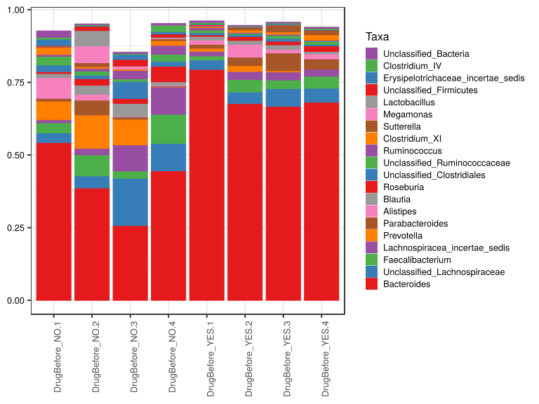

noone@mail.com
Analysis of Dieting study 16S data
% Fri Sep  7 05:46:18 2018

##### \(1.7.1.1.3\) Plots of Abundance.

Plots are shown with relation to various combinations of meta 
                   data variables and in different graphical representations. Lots of plots here.

##### \(1.7.1.1.3.2\) Iterating over all combinations of grouping variables

##### \(1.7.1.1.3.2.1\) Entire pool of samples

##### \(1.7.1.1.3.2.2\) Iterating over Abundance. profile sorting order

##### \(1.7.1.1.3.2.2.1\) Abundance. profile sorting order: average abundance

##### \(1.7.1.1.3.2.2.2\) Iterating over dodged vs faceted bars

The same data are shown in multiple combinations of graphical representations. 
                         This is the same data, but each plot highlights slightly different aspects of it.
                         It is not likely that you will need every plot - pick only what you need.

##### \(1.7.1.1.3.2.2.2.1\) faceted plots. Iterating over orientation and, optionally, scaling

##### \(1.7.1.1.3.2.2.2.1.1\) Abundance. Plot is in original orientation, Y axis SQRT scaled. Iterating over plot geometry

\(1.7.1.1.3.2.2.2.1.1.0\) [`Table 451.`](#table.451) Data table used for plots. Data for all pooled samples. Showing only 200 first rows. Full dataset is also saved in a delimited text file (click to download and open e.g. in Excel) [`data/1.7.1.1.3.2.2.2.1.1.0-323284c8759.1.7.1.1.3.2.2.2.1.1.csv`](data/1.7.1.1.3.2.2.2.1.1.0-323284c8759.1.7.1.1.3.2.2.2.1.1.csv)

| .record.id        | SampleID          | feature                              | Abundance  |
|:------------------|:------------------|:-------------------------------------|:-----------|
| DrugBefore\_NO.1  | DrugBefore\_NO.1  | Bacteroides                          | 5.429e\-01 |
| DrugBefore\_NO.2  | DrugBefore\_NO.2  | Bacteroides                          | 3.866e\-01 |
| DrugBefore\_NO.3  | DrugBefore\_NO.3  | Bacteroides                          | 2.572e\-01 |
| DrugBefore\_NO.4  | DrugBefore\_NO.4  | Bacteroides                          | 4.455e\-01 |
| DrugBefore\_YES.1 | DrugBefore\_YES.1 | Bacteroides                          | 7.944e\-01 |
| DrugBefore\_YES.2 | DrugBefore\_YES.2 | Bacteroides                          | 6.769e\-01 |
| DrugBefore\_YES.3 | DrugBefore\_YES.3 | Bacteroides                          | 6.673e\-01 |
| DrugBefore\_YES.4 | DrugBefore\_YES.4 | Bacteroides                          | 6.816e\-01 |
| DrugBefore\_NO.1  | DrugBefore\_NO.1  | Prevotella                           | 6.412e\-02 |
| DrugBefore\_NO.2  | DrugBefore\_NO.2  | Prevotella                           | 1.146e\-01 |
| DrugBefore\_NO.3  | DrugBefore\_NO.3  | Prevotella                           | 8.824e\-02 |
| DrugBefore\_NO.4  | DrugBefore\_NO.4  | Prevotella                           | 1.517e\-03 |
| DrugBefore\_YES.1 | DrugBefore\_YES.1 | Prevotella                           | 1.074e\-02 |
| DrugBefore\_YES.2 | DrugBefore\_YES.2 | Prevotella                           | 2.055e\-02 |
| DrugBefore\_YES.3 | DrugBefore\_YES.3 | Prevotella                           | 4.400e\-03 |
| DrugBefore\_YES.4 | DrugBefore\_YES.4 | Prevotella                           | 2.199e\-04 |
| DrugBefore\_NO.1  | DrugBefore\_NO.1  | Unclassified\_Lachnospiraceae        | 3.296e\-02 |
| DrugBefore\_NO.2  | DrugBefore\_NO.2  | Unclassified\_Lachnospiraceae        | 4.143e\-02 |
| DrugBefore\_NO.3  | DrugBefore\_NO.3  | Unclassified\_Lachnospiraceae        | 1.627e\-01 |
| DrugBefore\_NO.4  | DrugBefore\_NO.4  | Unclassified\_Lachnospiraceae        | 9.412e\-02 |
| DrugBefore\_YES.1 | DrugBefore\_YES.1 | Unclassified\_Lachnospiraceae        | 3.250e\-02 |
| DrugBefore\_YES.2 | DrugBefore\_YES.2 | Unclassified\_Lachnospiraceae        | 3.994e\-02 |
| DrugBefore\_YES.3 | DrugBefore\_YES.3 | Unclassified\_Lachnospiraceae        | 6.130e\-02 |
| DrugBefore\_YES.4 | DrugBefore\_YES.4 | Unclassified\_Lachnospiraceae        | 4.805e\-02 |
| DrugBefore\_NO.1  | DrugBefore\_NO.1  | Faecalibacterium                     | 3.496e\-02 |
| DrugBefore\_NO.2  | DrugBefore\_NO.2  | Faecalibacterium                     | 7.224e\-02 |
| DrugBefore\_NO.3  | DrugBefore\_NO.3  | Faecalibacterium                     | 2.513e\-02 |
| DrugBefore\_NO.4  | DrugBefore\_NO.4  | Faecalibacterium                     | 1.004e\-01 |
| DrugBefore\_YES.1 | DrugBefore\_YES.1 | Faecalibacterium                     | 1.388e\-02 |
| DrugBefore\_YES.2 | DrugBefore\_YES.2 | Faecalibacterium                     | 4.290e\-02 |
| DrugBefore\_YES.3 | DrugBefore\_YES.3 | Faecalibacterium                     | 2.949e\-02 |
| DrugBefore\_YES.4 | DrugBefore\_YES.4 | Faecalibacterium                     | 4.123e\-02 |
| DrugBefore\_NO.1  | DrugBefore\_NO.1  | Parabacteroides                      | 9.225e\-03 |
| DrugBefore\_NO.2  | DrugBefore\_NO.2  | Parabacteroides                      | 5.090e\-02 |
| DrugBefore\_NO.3  | DrugBefore\_NO.3  | Parabacteroides                      | 7.726e\-03 |
| DrugBefore\_NO.4  | DrugBefore\_NO.4  | Parabacteroides                      | 1.548e\-03 |
| DrugBefore\_YES.1 | DrugBefore\_YES.1 | Parabacteroides                      | 1.341e\-02 |
| DrugBefore\_YES.2 | DrugBefore\_YES.2 | Parabacteroides                      | 2.904e\-02 |
| DrugBefore\_YES.3 | DrugBefore\_YES.3 | Parabacteroides                      | 6.104e\-02 |
| DrugBefore\_YES.4 | DrugBefore\_YES.4 | Parabacteroides                      | 3.482e\-02 |
| DrugBefore\_NO.1  | DrugBefore\_NO.1  | Lachnospiracea\_incertae\_sedis      | 1.058e\-02 |
| DrugBefore\_NO.2  | DrugBefore\_NO.2  | Lachnospiracea\_incertae\_sedis      | 2.267e\-02 |
| DrugBefore\_NO.3  | DrugBefore\_NO.3  | Lachnospiracea\_incertae\_sedis      | 8.973e\-02 |
| DrugBefore\_NO.4  | DrugBefore\_NO.4  | Lachnospiracea\_incertae\_sedis      | 9.424e\-02 |
| DrugBefore\_YES.1 | DrugBefore\_YES.1 | Lachnospiracea\_incertae\_sedis      | 1.580e\-02 |
| DrugBefore\_YES.2 | DrugBefore\_YES.2 | Lachnospiracea\_incertae\_sedis      | 2.756e\-02 |
| DrugBefore\_YES.3 | DrugBefore\_YES.3 | Lachnospiracea\_incertae\_sedis      | 2.747e\-02 |
| DrugBefore\_YES.4 | DrugBefore\_YES.4 | Lachnospiracea\_incertae\_sedis      | 2.465e\-02 |
| DrugBefore\_NO.1  | DrugBefore\_NO.1  | Alistipes                            | 7.061e\-02 |
| DrugBefore\_NO.2  | DrugBefore\_NO.2  | Alistipes                            | 2.018e\-02 |
| DrugBefore\_NO.3  | DrugBefore\_NO.3  | Alistipes                            | 1.263e\-03 |
| DrugBefore\_NO.4  | DrugBefore\_NO.4  | Alistipes                            | 2.210e\-03 |
| DrugBefore\_YES.1 | DrugBefore\_YES.1 | Alistipes                            | 1.462e\-02 |
| DrugBefore\_YES.2 | DrugBefore\_YES.2 | Alistipes                            | 4.380e\-02 |
| DrugBefore\_YES.3 | DrugBefore\_YES.3 | Alistipes                            | 1.282e\-02 |
| DrugBefore\_YES.4 | DrugBefore\_YES.4 | Alistipes                            | 1.716e\-02 |
| DrugBefore\_NO.1  | DrugBefore\_NO.1  | Blautia                              | 1.473e\-02 |
| DrugBefore\_NO.2  | DrugBefore\_NO.2  | Blautia                              | 3.146e\-02 |
| DrugBefore\_NO.3  | DrugBefore\_NO.3  | Blautia                              | 4.523e\-02 |
| DrugBefore\_NO.4  | DrugBefore\_NO.4  | Blautia                              | 1.213e\-02 |
| DrugBefore\_YES.1 | DrugBefore\_YES.1 | Blautia                              | 1.284e\-02 |
| DrugBefore\_YES.2 | DrugBefore\_YES.2 | Blautia                              | 1.351e\-02 |
| DrugBefore\_YES.3 | DrugBefore\_YES.3 | Blautia                              | 1.521e\-02 |
| DrugBefore\_YES.4 | DrugBefore\_YES.4 | Blautia                              | 8.443e\-03 |
| DrugBefore\_NO.1  | DrugBefore\_NO.1  | Roseburia                            | 6.611e\-03 |
| DrugBefore\_NO.2  | DrugBefore\_NO.2  | Roseburia                            | 2.237e\-02 |
| DrugBefore\_NO.3  | DrugBefore\_NO.3  | Roseburia                            | 1.719e\-02 |
| DrugBefore\_NO.4  | DrugBefore\_NO.4  | Roseburia                            | 5.367e\-02 |
| DrugBefore\_YES.1 | DrugBefore\_YES.1 | Roseburia                            | 5.158e\-03 |
| DrugBefore\_YES.2 | DrugBefore\_YES.2 | Roseburia                            | 1.332e\-02 |
| DrugBefore\_YES.3 | DrugBefore\_YES.3 | Roseburia                            | 1.224e\-02 |
| DrugBefore\_YES.4 | DrugBefore\_YES.4 | Roseburia                            | 1.914e\-02 |
| DrugBefore\_NO.1  | DrugBefore\_NO.1  | Unclassified\_Clostridiales          | 2.257e\-02 |
| DrugBefore\_NO.2  | DrugBefore\_NO.2  | Unclassified\_Clostridiales          | 1.209e\-02 |
| DrugBefore\_NO.3  | DrugBefore\_NO.3  | Unclassified\_Clostridiales          | 5.826e\-02 |
| DrugBefore\_NO.4  | DrugBefore\_NO.4  | Unclassified\_Clostridiales          | 1.729e\-02 |
| DrugBefore\_YES.1 | DrugBefore\_YES.1 | Unclassified\_Clostridiales          | 7.113e\-03 |
| DrugBefore\_YES.2 | DrugBefore\_YES.2 | Unclassified\_Clostridiales          | 6.403e\-03 |
| DrugBefore\_YES.3 | DrugBefore\_YES.3 | Unclassified\_Clostridiales          | 9.606e\-03 |
| DrugBefore\_YES.4 | DrugBefore\_YES.4 | Unclassified\_Clostridiales          | 5.508e\-03 |
| DrugBefore\_NO.1  | DrugBefore\_NO.1  | Lactobacillus                        | 4.443e\-04 |
| DrugBefore\_NO.2  | DrugBefore\_NO.2  | Lactobacillus                        | 5.274e\-02 |
| DrugBefore\_NO.3  | DrugBefore\_NO.3  | Lactobacillus                        | 9.942e\-04 |
| DrugBefore\_NO.4  | DrugBefore\_NO.4  | Lactobacillus                        | 3.406e\-03 |
| DrugBefore\_YES.1 | DrugBefore\_YES.1 | Lactobacillus                        | 0.000e\+00 |
| DrugBefore\_YES.2 | DrugBefore\_YES.2 | Lactobacillus                        | 6.385e\-05 |
| DrugBefore\_YES.3 | DrugBefore\_YES.3 | Lactobacillus                        | 0.000e\+00 |
| DrugBefore\_YES.4 | DrugBefore\_YES.4 | Lactobacillus                        | 0.000e\+00 |
| DrugBefore\_NO.1  | DrugBefore\_NO.1  | Clostridium\_XI                      | 2.496e\-02 |
| DrugBefore\_NO.2  | DrugBefore\_NO.2  | Clostridium\_XI                      | 5.186e\-03 |
| DrugBefore\_NO.3  | DrugBefore\_NO.3  | Clostridium\_XI                      | 4.729e\-03 |
| DrugBefore\_NO.4  | DrugBefore\_NO.4  | Clostridium\_XI                      | 1.571e\-02 |
| DrugBefore\_YES.1 | DrugBefore\_YES.1 | Clostridium\_XI                      | 2.773e\-03 |
| DrugBefore\_YES.2 | DrugBefore\_YES.2 | Clostridium\_XI                      | 8.314e\-03 |
| DrugBefore\_YES.3 | DrugBefore\_YES.3 | Clostridium\_XI                      | 7.987e\-03 |
| DrugBefore\_YES.4 | DrugBefore\_YES.4 | Clostridium\_XI                      | 1.824e\-02 |
| DrugBefore\_NO.1  | DrugBefore\_NO.1  | Erysipelotrichaceae\_incertae\_sedis | 2.153e\-02 |
| DrugBefore\_NO.2  | DrugBefore\_NO.2  | Erysipelotrichaceae\_incertae\_sedis | 1.775e\-03 |
| DrugBefore\_NO.3  | DrugBefore\_NO.3  | Erysipelotrichaceae\_incertae\_sedis | 1.652e\-02 |
| DrugBefore\_NO.4  | DrugBefore\_NO.4  | Erysipelotrichaceae\_incertae\_sedis | 7.797e\-03 |
| DrugBefore\_YES.1 | DrugBefore\_YES.1 | Erysipelotrichaceae\_incertae\_sedis | 2.021e\-03 |
| DrugBefore\_YES.2 | DrugBefore\_YES.2 | Erysipelotrichaceae\_incertae\_sedis | 8.569e\-04 |
| DrugBefore\_YES.3 | DrugBefore\_YES.3 | Erysipelotrichaceae\_incertae\_sedis | 2.717e\-03 |
| DrugBefore\_YES.4 | DrugBefore\_YES.4 | Erysipelotrichaceae\_incertae\_sedis | 1.548e\-03 |
| DrugBefore\_NO.1  | DrugBefore\_NO.1  | Enterococcus                         | 6.167e\-03 |
| DrugBefore\_NO.2  | DrugBefore\_NO.2  | Enterococcus                         | 4.992e\-04 |
| DrugBefore\_NO.3  | DrugBefore\_NO.3  | Enterococcus                         | 4.511e\-04 |
| DrugBefore\_NO.4  | DrugBefore\_NO.4  | Enterococcus                         | 1.756e\-05 |
| DrugBefore\_YES.1 | DrugBefore\_YES.1 | Enterococcus                         | 2.044e\-04 |
| DrugBefore\_YES.2 | DrugBefore\_YES.2 | Enterococcus                         | 2.016e\-02 |
| DrugBefore\_YES.3 | DrugBefore\_YES.3 | Enterococcus                         | 1.335e\-04 |
| DrugBefore\_YES.4 | DrugBefore\_YES.4 | Enterococcus                         | 2.436e\-04 |
| DrugBefore\_NO.1  | DrugBefore\_NO.1  | Unclassified\_Ruminococcaceae        | 3.022e\-02 |
| DrugBefore\_NO.2  | DrugBefore\_NO.2  | Unclassified\_Ruminococcaceae        | 1.422e\-02 |
| DrugBefore\_NO.3  | DrugBefore\_NO.3  | Unclassified\_Ruminococcaceae        | 9.144e\-03 |
| DrugBefore\_NO.4  | DrugBefore\_NO.4  | Unclassified\_Ruminococcaceae        | 2.368e\-02 |
| DrugBefore\_YES.1 | DrugBefore\_YES.1 | Unclassified\_Ruminococcaceae        | 9.195e\-03 |
| DrugBefore\_YES.2 | DrugBefore\_YES.2 | Unclassified\_Ruminococcaceae        | 4.469e\-03 |
| DrugBefore\_YES.3 | DrugBefore\_YES.3 | Unclassified\_Ruminococcaceae        | 1.094e\-02 |
| DrugBefore\_YES.4 | DrugBefore\_YES.4 | Unclassified\_Ruminococcaceae        | 1.127e\-02 |
| DrugBefore\_NO.1  | DrugBefore\_NO.1  | Sutterella                           | 3.146e\-03 |
| DrugBefore\_NO.2  | DrugBefore\_NO.2  | Sutterella                           | 1.365e\-02 |
| DrugBefore\_NO.3  | DrugBefore\_NO.3  | Sutterella                           | 9.023e\-05 |
| DrugBefore\_NO.4  | DrugBefore\_NO.4  | Sutterella                           | 6.791e\-03 |
| DrugBefore\_YES.1 | DrugBefore\_YES.1 | Sutterella                           | 2.187e\-03 |
| DrugBefore\_YES.2 | DrugBefore\_YES.2 | Sutterella                           | 8.361e\-03 |
| DrugBefore\_YES.3 | DrugBefore\_YES.3 | Sutterella                           | 2.365e\-02 |
| DrugBefore\_YES.4 | DrugBefore\_YES.4 | Sutterella                           | 1.493e\-02 |
| DrugBefore\_NO.1  | DrugBefore\_NO.1  | Escherichia\_Shigella                | 7.802e\-03 |
| DrugBefore\_NO.2  | DrugBefore\_NO.2  | Escherichia\_Shigella                | 9.703e\-04 |
| DrugBefore\_NO.3  | DrugBefore\_NO.3  | Escherichia\_Shigella                | 1.916e\-03 |
| DrugBefore\_NO.4  | DrugBefore\_NO.4  | Escherichia\_Shigella                | 1.499e\-04 |
| DrugBefore\_YES.1 | DrugBefore\_YES.1 | Escherichia\_Shigella                | 4.620e\-03 |
| DrugBefore\_YES.2 | DrugBefore\_YES.2 | Escherichia\_Shigella                | 1.820e\-05 |
| DrugBefore\_YES.3 | DrugBefore\_YES.3 | Escherichia\_Shigella                | 1.505e\-03 |
| DrugBefore\_YES.4 | DrugBefore\_YES.4 | Escherichia\_Shigella                | 1.723e\-02 |
| DrugBefore\_NO.1  | DrugBefore\_NO.1  | Megamonas                            | 6.143e\-06 |
| DrugBefore\_NO.2  | DrugBefore\_NO.2  | Megamonas                            | 5.785e\-02 |
| DrugBefore\_NO.3  | DrugBefore\_NO.3  | Megamonas                            | 9.384e\-03 |
| DrugBefore\_NO.4  | DrugBefore\_NO.4  | Megamonas                            | 2.046e\-03 |
| DrugBefore\_YES.1 | DrugBefore\_YES.1 | Megamonas                            | 1.865e\-03 |
| DrugBefore\_YES.2 | DrugBefore\_YES.2 | Megamonas                            | 0.000e\+00 |
| DrugBefore\_YES.3 | DrugBefore\_YES.3 | Megamonas                            | 0.000e\+00 |
| DrugBefore\_YES.4 | DrugBefore\_YES.4 | Megamonas                            | 1.342e\-04 |
| DrugBefore\_NO.1  | DrugBefore\_NO.1  | Ruminococcus                         | 6.134e\-03 |
| DrugBefore\_NO.2  | DrugBefore\_NO.2  | Ruminococcus                         | 9.667e\-03 |
| DrugBefore\_NO.3  | DrugBefore\_NO.3  | Ruminococcus                         | 2.929e\-02 |
| DrugBefore\_NO.4  | DrugBefore\_NO.4  | Ruminococcus                         | 3.102e\-02 |
| DrugBefore\_YES.1 | DrugBefore\_YES.1 | Ruminococcus                         | 8.146e\-03 |
| DrugBefore\_YES.2 | DrugBefore\_YES.2 | Ruminococcus                         | 3.491e\-03 |
| DrugBefore\_YES.3 | DrugBefore\_YES.3 | Ruminococcus                         | 3.522e\-03 |
| DrugBefore\_YES.4 | DrugBefore\_YES.4 | Ruminococcus                         | 3.363e\-03 |
| DrugBefore\_NO.1  | DrugBefore\_NO.1  | Clostridium\_XlVa                    | 8.489e\-03 |
| DrugBefore\_NO.2  | DrugBefore\_NO.2  | Clostridium\_XlVa                    | 2.401e\-03 |
| DrugBefore\_NO.3  | DrugBefore\_NO.3  | Clostridium\_XlVa                    | 1.387e\-02 |
| DrugBefore\_NO.4  | DrugBefore\_NO.4  | Clostridium\_XlVa                    | 7.594e\-03 |
| DrugBefore\_YES.1 | DrugBefore\_YES.1 | Clostridium\_XlVa                    | 5.677e\-03 |
| DrugBefore\_YES.2 | DrugBefore\_YES.2 | Clostridium\_XlVa                    | 2.440e\-03 |
| DrugBefore\_YES.3 | DrugBefore\_YES.3 | Clostridium\_XlVa                    | 3.763e\-03 |
| DrugBefore\_YES.4 | DrugBefore\_YES.4 | Clostridium\_XlVa                    | 4.764e\-03 |
| DrugBefore\_NO.1  | DrugBefore\_NO.1  | Haemophilus                          | 5.966e\-04 |
| DrugBefore\_NO.2  | DrugBefore\_NO.2  | Haemophilus                          | 2.118e\-03 |
| DrugBefore\_NO.3  | DrugBefore\_NO.3  | Haemophilus                          | 1.132e\-02 |
| DrugBefore\_NO.4  | DrugBefore\_NO.4  | Haemophilus                          | 7.842e\-03 |
| DrugBefore\_YES.1 | DrugBefore\_YES.1 | Haemophilus                          | 1.028e\-04 |
| DrugBefore\_YES.2 | DrugBefore\_YES.2 | Haemophilus                          | 3.847e\-04 |
| DrugBefore\_YES.3 | DrugBefore\_YES.3 | Haemophilus                          | 1.433e\-03 |
| DrugBefore\_YES.4 | DrugBefore\_YES.4 | Haemophilus                          | 5.104e\-03 |
| DrugBefore\_NO.1  | DrugBefore\_NO.1  | Unclassified\_Bacteroidales          | 3.260e\-03 |
| DrugBefore\_NO.2  | DrugBefore\_NO.2  | Unclassified\_Bacteroidales          | 1.360e\-02 |
| DrugBefore\_NO.3  | DrugBefore\_NO.3  | Unclassified\_Bacteroidales          | 1.860e\-03 |
| DrugBefore\_NO.4  | DrugBefore\_NO.4  | Unclassified\_Bacteroidales          | 5.726e\-04 |
| DrugBefore\_YES.1 | DrugBefore\_YES.1 | Unclassified\_Bacteroidales          | 3.809e\-03 |
| DrugBefore\_YES.2 | DrugBefore\_YES.2 | Unclassified\_Bacteroidales          | 2.517e\-03 |
| DrugBefore\_YES.3 | DrugBefore\_YES.3 | Unclassified\_Bacteroidales          | 3.297e\-03 |
| DrugBefore\_YES.4 | DrugBefore\_YES.4 | Unclassified\_Bacteroidales          | 4.037e\-03 |
| DrugBefore\_NO.1  | DrugBefore\_NO.1  | Unclassified\_Bacteria               | 2.185e\-02 |
| DrugBefore\_NO.2  | DrugBefore\_NO.2  | Unclassified\_Bacteria               | 2.949e\-03 |
| DrugBefore\_NO.3  | DrugBefore\_NO.3  | Unclassified\_Bacteria               | 5.404e\-03 |
| DrugBefore\_NO.4  | DrugBefore\_NO.4  | Unclassified\_Bacteria               | 6.176e\-03 |
| DrugBefore\_YES.1 | DrugBefore\_YES.1 | Unclassified\_Bacteria               | 5.331e\-03 |
| DrugBefore\_YES.2 | DrugBefore\_YES.2 | Unclassified\_Bacteria               | 2.270e\-03 |
| DrugBefore\_YES.3 | DrugBefore\_YES.3 | Unclassified\_Bacteria               | 3.104e\-03 |
| DrugBefore\_YES.4 | DrugBefore\_YES.4 | Unclassified\_Bacteria               | 4.339e\-03 |
| DrugBefore\_NO.1  | DrugBefore\_NO.1  | Unclassified\_Firmicutes             | 2.474e\-03 |
| DrugBefore\_NO.2  | DrugBefore\_NO.2  | Unclassified\_Firmicutes             | 1.475e\-02 |
| DrugBefore\_NO.3  | DrugBefore\_NO.3  | Unclassified\_Firmicutes             | 2.237e\-02 |
| DrugBefore\_NO.4  | DrugBefore\_NO.4  | Unclassified\_Firmicutes             | 1.086e\-02 |
| DrugBefore\_YES.1 | DrugBefore\_YES.1 | Unclassified\_Firmicutes             | 3.551e\-03 |
| DrugBefore\_YES.2 | DrugBefore\_YES.2 | Unclassified\_Firmicutes             | 9.642e\-04 |
| DrugBefore\_YES.3 | DrugBefore\_YES.3 | Unclassified\_Firmicutes             | 1.092e\-03 |
| DrugBefore\_YES.4 | DrugBefore\_YES.4 | Unclassified\_Firmicutes             | 7.750e\-04 |
| DrugBefore\_NO.1  | DrugBefore\_NO.1  | Clostridium\_XVIII                   | 3.492e\-03 |
| DrugBefore\_NO.2  | DrugBefore\_NO.2  | Clostridium\_XVIII                   | 4.506e\-03 |
| DrugBefore\_NO.3  | DrugBefore\_NO.3  | Clostridium\_XVIII                   | 1.663e\-02 |
| DrugBefore\_NO.4  | DrugBefore\_NO.4  | Clostridium\_XVIII                   | 4.284e\-03 |
| DrugBefore\_YES.1 | DrugBefore\_YES.1 | Clostridium\_XVIII                   | 4.604e\-03 |
| DrugBefore\_YES.2 | DrugBefore\_YES.2 | Clostridium\_XVIII                   | 1.335e\-03 |
| DrugBefore\_YES.3 | DrugBefore\_YES.3 | Clostridium\_XVIII                   | 2.252e\-03 |
| DrugBefore\_YES.4 | DrugBefore\_YES.4 | Clostridium\_XVIII                   | 2.160e\-03 |

\(1.7.1.1.3.2.2.2.1.1.1\) [`Widget 466.`](#widget.466) Dynamic Pivot Table link (drag and drop field names and pick averaging 
                      functions or plot types; click on fields or legend elements to filter values). 
                      Starting rendering is Stacked Bar Chart. Data for all pooled samples. Click to see HTML widget file in full window: [`./1.7.1.1.3.2.2.2.1.1.1-3233705f5f8Dynamic.Pivot.Table.html`](./1.7.1.1.3.2.2.2.1.1.1-3233705f5f8Dynamic.Pivot.Table.html)

\(1.7.1.1.3.2.2.2.1.1.1\) [`Widget 467.`](#widget.467) Dynamic Pivot Table link (drag and drop field names and pick averaging 
                      functions or plot types; click on fields or legend elements to filter values). 
                      Starting rendering is Table Barchart. Data for all pooled samples. Click to see HTML widget file in full window: [`./1.7.1.1.3.2.2.2.1.1.1-3232232d025Dynamic.Pivot.Table.html`](./1.7.1.1.3.2.2.2.1.1.1-3232232d025Dynamic.Pivot.Table.html)

\(1.7.1.1.3.2.2.2.1.1.1\) [`Table 452.`](#table.452) Summary table. Data for all pooled samples. Full dataset is also saved in a delimited text file (click to download and open e.g. in Excel) [`data/1.7.1.1.3.2.2.2.1.1.1-323b987a68.1.7.1.1.3.2.2.2.1.1.csv`](data/1.7.1.1.3.2.2.2.1.1.1-323b987a68.1.7.1.1.3.2.2.2.1.1.csv)

| feature                              | mean      | sd        | median     | incidence |
|:-------------------------------------|:----------|:----------|:-----------|:----------|
| Bacteroides                          | 0.5565167 | 0.1812523 | 6.051e\-01 | 1.000     |
| Unclassified\_Lachnospiraceae        | 0.0641261 | 0.0446493 | 4.474e\-02 | 1.000     |
| Faecalibacterium                     | 0.0450333 | 0.0281301 | 3.810e\-02 | 1.000     |
| Lachnospiracea\_incertae\_sedis      | 0.0390880 | 0.0331816 | 2.606e\-02 | 1.000     |
| Prevotella                           | 0.0380482 | 0.0447342 | 1.565e\-02 | 1.000     |
| Parabacteroides                      | 0.0259636 | 0.0217343 | 2.122e\-02 | 1.000     |
| Alistipes                            | 0.0228337 | 0.0233608 | 1.589e\-02 | 1.000     |
| Blautia                              | 0.0191951 | 0.0125488 | 1.412e\-02 | 1.000     |
| Roseburia                            | 0.0187125 | 0.0153024 | 1.525e\-02 | 1.000     |
| Unclassified\_Clostridiales          | 0.0173553 | 0.0175387 | 1.085e\-02 | 1.000     |
| Unclassified\_Ruminococcaceae        | 0.0141422 | 0.0085436 | 1.111e\-02 | 1.000     |
| Ruminococcus                         | 0.0118291 | 0.0115513 | 7.140e\-03 | 1.000     |
| Clostridium\_XI                      | 0.0109872 | 0.0078063 | 8.150e\-03 | 1.000     |
| Sutterella                           | 0.0091002 | 0.0078975 | 7.576e\-03 | 1.000     |
| Megamonas                            | 0.0089110 | 0.0200266 | 9.996e\-04 | 0.750     |
| Lactobacillus                        | 0.0072067 | 0.0184365 | 2.541e\-04 | 0.625     |
| Unclassified\_Firmicutes             | 0.0071049 | 0.0080501 | 3.012e\-03 | 1.000     |
| Erysipelotrichaceae\_incertae\_sedis | 0.0068464 | 0.0079305 | 2.369e\-03 | 1.000     |
| Clostridium\_IV                      | 0.0065471 | 0.0065787 | 3.991e\-03 | 1.000     |
| Unclassified\_Bacteria               | 0.0064275 | 0.0063792 | 4.835e\-03 | 1.000     |
| Clostridium\_XlVa                    | 0.0061253 | 0.0038332 | 5.221e\-03 | 1.000     |
| Clostridium\_XVIII                   | 0.0049079 | 0.0048905 | 3.888e\-03 | 1.000     |
| Escherichia\_Shigella                | 0.0042762 | 0.0058512 | 1.710e\-03 | 1.000     |
| Unclassified\_Clostridiaceae\_1      | 0.0041401 | 0.0101515 | 3.196e\-04 | 1.000     |
| Unclassified\_Bacteroidales          | 0.0041191 | 0.0039943 | 3.278e\-03 | 1.000     |
| Veillonella                          | 0.0040383 | 0.0058361 | 1.764e\-03 | 1.000     |
| Haemophilus                          | 0.0036127 | 0.0041118 | 1.776e\-03 | 1.000     |
| Enterococcus                         | 0.0034840 | 0.0070485 | 3.474e\-04 | 1.000     |
| Dorea                                | 0.0034649 | 0.0027036 | 2.565e\-03 | 1.000     |
| Clostridium\_sensu\_stricto          | 0.0031970 | 0.0037771 | 2.342e\-03 | 1.000     |
| Phascolarctobacterium                | 0.0029053 | 0.0036805 | 1.490e\-03 | 0.875     |
| Gemmiger                             | 0.0028945 | 0.0022538 | 2.261e\-03 | 1.000     |
| Streptococcus                        | 0.0028695 | 0.0044010 | 1.506e\-03 | 1.000     |
| Flavonifractor                       | 0.0023476 | 0.0009293 | 2.240e\-03 | 1.000     |
| Akkermansia                          | 0.0018100 | 0.0028856 | 4.349e\-04 | 0.875     |
| Klebsiella                           | 0.0017253 | 0.0034306 | 3.002e\-04 | 0.875     |
| Unclassified\_Burkholderiales        | 0.0016119 | 0.0028877 | 3.193e\-05 | 0.625     |
| Barnesiella                          | 0.0015650 | 0.0022526 | 4.045e\-04 | 0.875     |
| Bifidobacterium                      | 0.0014856 | 0.0007881 | 1.456e\-03 | 1.000     |
| Odoribacter                          | 0.0013871 | 0.0011584 | 1.017e\-03 | 1.000     |
| Turicibacter                         | 0.0013744 | 0.0017783 | 4.195e\-04 | 1.000     |
| Paraprevotella                       | 0.0006834 | 0.0010263 | 1.991e\-04 | 0.875     |

\(1.7.1.1.3.2.2.2.1.1.1\) [`Figure 1059.`](#figure.1059) Abundance. Data for all pooled samples.  bar_stacked plot.  Image file: [`plots/32317898c97.svg`](plots/32317898c97.svg).

##### \(1.7.1.1.3.2.2.2.1.2\) Abundance. Plot is in flipped orientation, Y axis not scaled. Iterating over plot geometry

